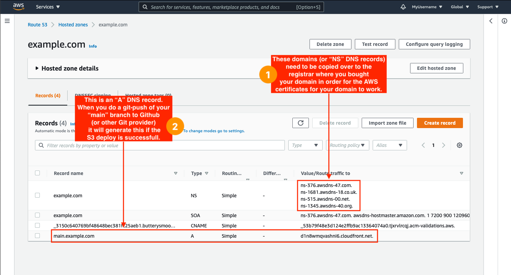

# Multi Dev Starter
A starter repo for anybody making a multi dev environment of static sites. This starter enables you to make changes on a new branch, push those changes and have a new static site environment with its own subdomain.

## Example
- Domain: `example.com`
- Github Branch: `mybranch`
- Resulting Environment: `https://mybranch.example.com`

# Requirements

You will need the following in order to get this starter up and running.

- AWS account with billing [to create multi-dev setup].
- Github account [to use Github Actions and Github Secrets].
- Need local AWS CLI configured and working.
- Need terraform CLI configured and working.
- Have a domain (e.g. mydomain.com) already bought and ready for its DNS settings to be configured. This will require knowledge on updating a domains NS records on your registrar.

# Install

## [Step] Fork repo

- First fork this repo.
- Then clone it down to your complete using `git clone`

## [Step] Create terraform.tfvars

You will need to create the file `<project-root>/terraform/terraform.tfvars` and fill it in like in the following code snippet. Each one of the fields is one of the terraform variables needed for the project to work.

```bash
# Location: <project-root>/terraform/terraform.tfvars

# AWS credentials
# You may be able to find these in one of these files
#  - ~/.aws/credentials
#  - ~/.aws/config

aws_access_key = "<aws access key>"
aws_secret_key = "<aws secret access key>"
aws_region     = "<region maybe 'us-east-1'>"

# General
team = "my-team"

# Sites
static_sites = [
  {
    hostname = "example.com",
    project  = "MultiDevExample"
  },
]
```

## [Step] Initialize terraform

```bash
# Naviate to project's terraform folder
cd <project-root>/terraform

# Init terraform project
terraform init

# (Optional) This will do a soft dry run of the terraform changes
terraform plan
```

## [Step] 🏗  Apply Terraform

Make sure to read all of the instructions of this step first. 

- Perform `terraform apply`, and while it's running go to the next step.

    ```bash
    # Naviate to project's terraform folder
    cd <project-root>/terraform

    # Updates AWS with infrastructure
    terraform apply
    ```

- Check AWS Route53 until the new Hosted Zones for your domains are showing up.
- Open the Hosted Zone for one of your domains and copy the NS records over to your registrar. These updates to your NS records might take time to propagate/apply. See image below for NS records.



- Your running instance of `terraform apply` may terminate with an error before these records are propagated enough for the instance to work. You will need to track your NS records and keep attempting `terraform apply` until it is successful. Some things to keep in mind:
    - [https://dnschecker.org](https://dnschecker.org/) - This is a great tool to track NS record propagation.
    - Applying changes to cloudfront will take a **few minutes**
    - If `terraform apply` is erroring with the certificates and the validation, it is most likely that the NS record configuration was not done properly.
- One `terraform apply` is able to complete successfully, the AWS architecture should be up and running.

## [Step] Github Secrets

This step will show how to configure Github Secrets so that Github Actions is able to build and deploy changes to AWS S3.

- On the forked Github repo, we will need to add the following Github Secrets
    - AWS_REGION
    - AWS_ACCESS_KEY_ID
    - AWS_SECRET_ACCESS_KEY
    - AWS_S3_MULTI_NAME
- The snippet below shows how to retrieve the values with an example.

```bash
# // Lets assume you have the following in your terraform.tfvars file
# static_sites = [
#   {
#     hostname = "example.com",
#     project  = "MyProject"
#   },
# ]

# We will need to run the following command to open up the terraform console
terraform console

# In the console we can evaluate the value of any AWS terraform state properties.
# In order to get the AWS_ACCESS_KEY_ID, you will need to type out
aws_iam_access_key.syncer["example.com"].id
# and hit enter. Terraform will output the value of it.

# For all the other Secrets see the mapping below

# 🔒 Github Secrets
# AWS_REGION             = aws_s3_bucket.multi["example.com"].region
# AWS_ACCESS_KEY_ID      = aws_iam_access_key.syncer["example.com"].id
# AWS_SECRET_ACCESS_KEY  = aws_iam_access_key.syncer["example.com"].secret
# AWS_S3_MULTI_NAME      = aws_s3_bucket.multi["example.com"].bucket

# Note: You can quit terraform console by running Ctrl+c
```

## [Final Step] ✅ Test and Verify

Either on the git `main` branch or another branch, open up the file `site/pages/index.js` and update line 15:

```bash
15: 👋 Hello, <span className="highlight">there</span>!
```

to anything you want. Commit the changes and push them up. Let's say we are on the branch `mybranch` with a domain `example.com`, once about 5min have passed [and CloudFront has finished its invalidation], navigate to `https://mybranch.example.com`  to see your new environment. 

NOTE: Instead of waiting a random amount of time, make sure to check the AWS CloudFront dashboard to see when the CloudFront Invalidation has finished.

# Terraform Variables

- `aws_access_key` - AWS access key for programmatic access. (Make sure to checkout this [link](https://docs.aws.amazon.com/general/latest/gr/aws-sec-cred-types.html).)
- `aws_secret_key` - AWS secret access key for programmatic access.  (Make sure to checkout this [link](https://docs.aws.amazon.com/general/latest/gr/aws-sec-cred-types.html).)
- `aws_region` - AWS region where infrastructure will live.
- `team` - This is used to prefix resources
- `static_sites` - Array of static sites
    - `hostname` - Domain name of static site.
    - `project` - Project associated with this domain. This is used for AWS tagging.